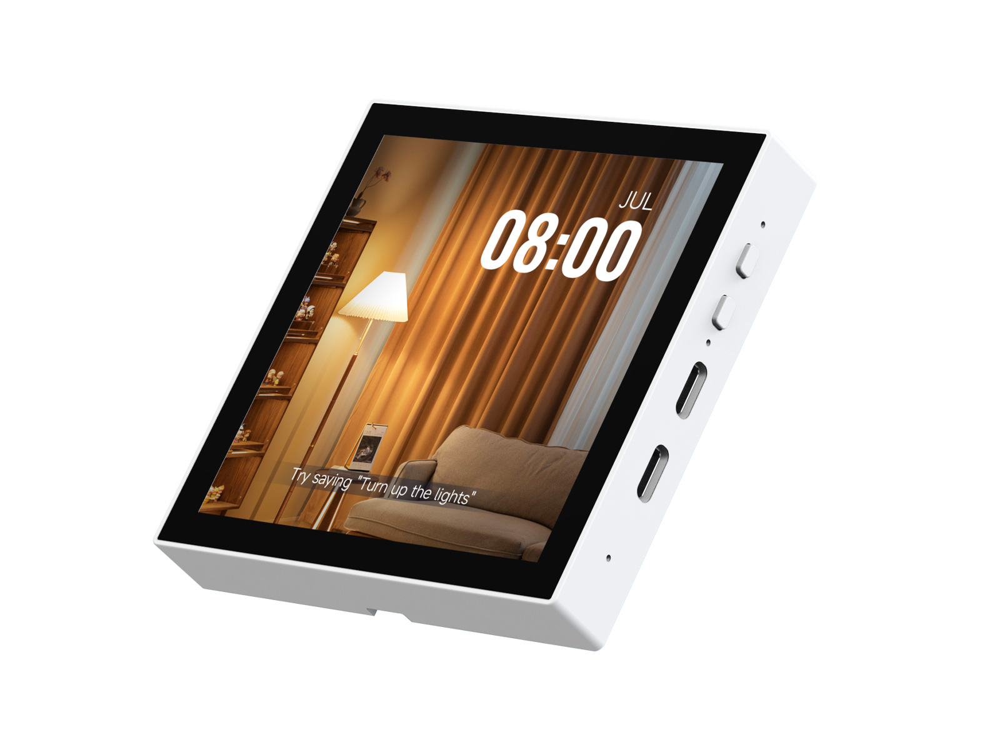

<div align="center">

<h1>ESP32-S3-Touch-LCD-4B</h1>

<strong>ESP32-S3 4 英寸 480 × 480 RGB LCD 触控开发板</strong>

<p>
  <a href="https://github.com/waveshareteam/ESP32-S3-Touch-LCD-4B/actions/workflows/examples.yml"></a>
  <a href="https://github.com/waveshareteam/ESP32-S3-Touch-LCD-4B/actions/workflows/repository-checks.yml"></a>
  <a href="LICENSE.txt"></a>
</p>

<p><a href="README.md">English</a> | <a href="README_ZH.md">简体中文</a></p>

<p>
  <a href="https://www.waveshare.com/esp32-s3-touch-lcd-4b.htm">🌐 产品页</a> ·
  <a href="examples/esp-idf/">🧩 ESP-IDF 示例</a> ·
  <a href="examples/arduino/">🔧 Arduino 示例</a> ·
  <a href="firmware/">📦 固件</a> ·
  <a href="docs/">📚 文档</a>
</p>



</div>

---

## ✨ 产品简介

ESP32-S3-Touch-LCD-4B 是 Waveshare 基于 ESP32-S3-WROOM-1-N16R8 模组设计的
智能控制面板开发板。板载 4 英寸 480 × 480 RGB LCD、五点电容触摸、音频输入输出、
运动传感器、RTC、电池电源管理和扩展接口，并采用 86 盒外形。

本仓库提供官方原理图和出厂固件、规范化的 ESP-IDF 与 Arduino 示例、可复现的 CI
构建流程，以及按示例生成的可烧录固件制品。产品资源同步自官方
[Waveshare Wiki](https://www.waveshare.com/wiki/ESP32-S3-Touch-LCD-4B)；来源 URL、
导入映射、大小、校验值和转载说明记录在[资源清单](docs/wiki-resources_ZH.md)中。

## 🖥️ 硬件概览

| 功能 | 规格 |
| --- | --- |
| 处理器模组 | ESP32-S3-WROOM-1-N16R8，双核 Xtensa LX7，最高 240 MHz |
| 存储 | 16 MB Flash、8 MB PSRAM |
| 无线 | 2.4 GHz Wi-Fi、Bluetooth 5（LE） |
| 显示 | 4 英寸 IPS LCD，480 × 480，65K 色，ST7701，RGB 接口 |
| 触摸 | GT911 电容触摸控制器，I2C，五点触摸 |
| 电源 | AXP2101 PMIC、USB-C 供电、3.7 V 锂电池接口与充电支持 |
| 音频 | ES7210 音频 ADC、ES8311 编解码器、板载麦克风、8 Ω / 2 W 扬声器接口 |
| 运动与计时 | QMI8658 六轴 IMU、PCF85063 RTC |
| 扩展 | TCA9554PWR GPIO 扩展器、USB、UART、2.0 mm GPIO 接口 |
| 板级支持 | ESP-IDF 托管组件 `waveshare/esp32_s3_touch_lcd_4b` |
| 硬件资料 | [原理图与硬件说明](hardware/README_ZH.md) |

当前示例使用的引脚已经与公开两页原理图及 Waveshare 托管 BSP 交叉核对，证据和边界
见[引脚审计](hardware/pin-audit_ZH.md)。尚未完成实物板卡和各硬件修订的验证，因此
构建通过只证明源码兼容与打包成功，不代表实物功能已经验证。

## 📦 CI 固件制品

[Build Examples](https://github.com/waveshareteam/ESP32-S3-Touch-LCD-4B/actions/workflows/examples.yml)
会分别构建每个第一方示例。成功任务上传一个可烧录 ZIP，其中包含清单、分段二进制、
合并二进制、跨平台烧录脚本，以及可用时由 ESP-IDF 生成的依赖锁文件。

使用制品：

1. 打开成功的 **Build Examples** 运行，下载与框架、示例和工具链匹配的
   `firmware-*` 制品。
2. 解压并安装 [esptool](https://docs.espressif.com/projects/esptool/en/latest/esp32/installation.html)。
3. Windows 运行 `flash.bat COMx`，Linux 运行 `./flash.sh /dev/ttyACM0`。

维护者可按运行编号批量下载并解包：

```bash
python3 releases/download_artifacts.py --run-id <run-id> --clean
```

省略 `--run-id` 时会选择当前分支最近一次成功运行。合并镜像从偏移 `0x0` 烧录；
制品结构和手工命令见[固件打包与烧录](releases/README_ZH.md)。

官方出厂镜像独立保存在 [firmware/](firmware/) 中。烧录前请使用
[firmware/checksums.sha256](firmware/checksums.sha256) 校验，并阅读
[出厂固件说明](firmware/README_ZH.md)；它不是源码构建 CI 的产物。

## 🧪 示例

### ESP-IDF

| 工程 | 功能 |
| --- | --- |
| [01_AXP2101](examples/esp-idf/01_AXP2101/) | AXP2101 电源管理 |
| [02_lvgl_demo_v9](examples/esp-idf/02_lvgl_demo_v9/) | LVGL v9 显示与触摸 |
| [03_esp-brookesia](examples/esp-idf/03_esp-brookesia/) | ESP-Brookesia 应用 |
| [04_Immersive_block](examples/esp-idf/04_Immersive_block/) | QMI8658 运动控制沉浸式方块 |
| [05_Spec_Analyzer](examples/esp-idf/05_Spec_Analyzer/) | 麦克风 FFT 频谱分析 |

### Arduino

| 草图 | 功能 |
| --- | --- |
| [01_HelloWorld](examples/arduino/examples/01_HelloWorld/) | 显示 Hello World |
| [02_GFX_AsciiTable](examples/arduino/examples/02_GFX_AsciiTable/) | Arduino GFX ASCII 表 |
| [03_LVGL_PCF85063_simpleTime](examples/arduino/examples/03_LVGL_PCF85063_simpleTime/) | LVGL 与 PCF85063 RTC |
| [04_LVGL_QMI8658_ui](examples/arduino/examples/04_LVGL_QMI8658_ui/) | LVGL 与 QMI8658 运动界面 |
| [05_LVGL_AXP2101_ADC_Data](examples/arduino/examples/05_LVGL_AXP2101_ADC_Data/) | 显示 AXP2101 ADC 数据 |
| [06_LVGL_Arduino_v9](examples/arduino/examples/06_LVGL_Arduino_v9/) | LVGL v9 Arduino 示例 |
| [07_ES8311](examples/arduino/examples/07_ES8311/) | ES8311 音频输出 |
| [08_ES7210](examples/arduino/examples/08_ES7210/) | ES7210 音频采集与 VAD |

官方压缩包导入基线是 ESP-IDF v5.4.2 和 Arduino-ESP32 3.2.0。当前 CI 使用：

| 框架 | 工具链 | 第一方示例 | 构建任务 |
| --- | --- | ---: | ---: |
| ESP-IDF | v5.5.5 | 5 | 5 |
| ESP-IDF | v6.0.2 | 5 | 5 |
| Arduino-ESP32 | 3.3.11 | 8 | 8 |

完整运行包含一个分类任务、18 个独立固件构建任务和一个稳定聚合门禁。纯文档修改只运行
分类与聚合门禁，不调度固件构建。随包 Arduino 库内部示例不会进入产品矩阵。详细规则
见 [CI 覆盖说明](docs/ci_ZH.md)。

## 🗂️ 仓库目录

| 路径 | 用途 |
| --- | --- |
| [examples/esp-idf/](examples/esp-idf/) | ESP-IDF 工程 |
| [examples/arduino/](examples/arduino/) | Arduino 草图与随包库 |
| [firmware/](firmware/) | 官方出厂/恢复二进制 |
| [releases/](releases/) | 源码构建固件打包工具与说明 |
| [hardware/](hardware/) | 原理图与硬件参考资料 |
| [docs/](docs/) | CI、资源来源、上电检查和维护文档 |
| [scripts/](scripts/) | 示例发现、差异路由与仓库维护工具 |

目录职责和命名规则见[仓库结构](docs/repository-structure_ZH.md)。原始 Demo ZIP 不重复
提交，其规范化内容保存在 `examples/` 和 `firmware/`；缺少来源/许可的 PCM 录音被有意
省略，并由运行时测试音替代。

## 📚 文档

- [Waveshare Wiki](https://www.waveshare.com/wiki/ESP32-S3-Touch-LCD-4B)
- [Wiki 资源清单](docs/wiki-resources_ZH.md)
- [硬件资料](hardware/README_ZH.md)
- [原理图引脚审计](hardware/pin-audit_ZH.md)
- [上电检查清单](docs/bring-up-checklist_ZH.md)
- [CI 覆盖说明](docs/ci_ZH.md)
- [固件打包与烧录](releases/README_ZH.md)
- [仓库结构](docs/repository-structure_ZH.md)

## 🤝 贡献与支持

- 提交修改前阅读 [CONTRIBUTING_ZH.md](CONTRIBUTING_ZH.md)。
- 支持渠道见 [SUPPORT_ZH.md](SUPPORT_ZH.md)。
- 安全问题按 [SECURITY_ZH.md](SECURITY_ZH.md) 报告。

## 📄 许可证

除非文件另有说明，本仓库使用 [Apache License 2.0](LICENSE.txt)。导入的组件、示例、
文档和图片保留原始条款；详见 [THIRD_PARTY_NOTICES_ZH.md](THIRD_PARTY_NOTICES_ZH.md)。
